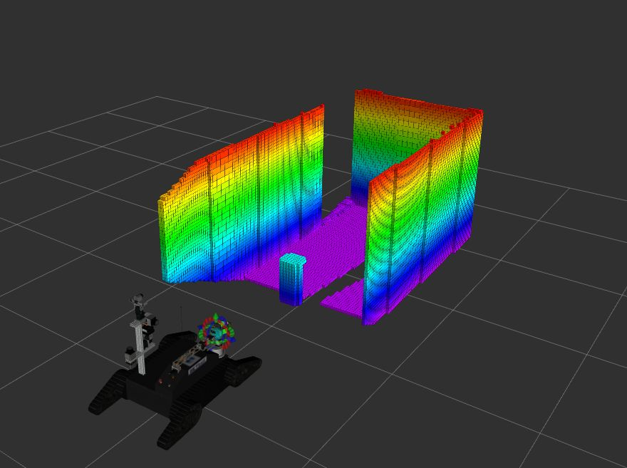

# Teasor

Robot attempting to perform grasp operation

  
# Short Description

Figure: Flow Chart of the Complete System

The src folder contains three main nodes : Planning, Executor and JoyControl.

* **Planning** : Uses Moveit! to plan trajectories.

* **Executor** : Executes the generated trajectory from planning node.

* **JoyControl** : This node contains implementation to deal with operator control with joystick.

Also, The following action classes are implemented that uses Planning and Executor nodes to plan a sequence of actions to complete a task:

* **GrabAction** : Executes sequence of actions to grasp an object, when a pose of the object to be grabbed is received.

* **DropAction** : Implements dropping action of the object after an object has been grabbed.

* **InspectAction** : Executes sequence of actions to move the arm to inspect position, when a pose of the object is received.

* **ExtractAction** : Executes sequence of actions to extract, when a pose of the object is received.

* **OpenCloseGripperAction** : Open / Close Gripper functionality is implemented here.

* The folder also contains ArmControlParameterList class that bridges ROS param server and different nodes. It also serves to provide setter/getter methods to set/get dynamic changes in the parameters into/from the yaml file.

* The Widgets folder contain GUI interface implemented using Qt Library.
# Usage and Commands to startup Arm Motion Planning
[***Warning!!!***]
The code in the current form will not compile as it has dependencies with other modules which are not included in this repo yet.

The following commands are to be executed in sequence. Make sure that a single command is fully running before executing the next one:

* roslaunch robocup_launch getjag.launch 			                   => Start the robot
* roslaunch getjag_moveit_config moveit.launch		               => Launch MoveIt!
* roslaunch arm_planning motion_planning.launch			             => Main Launch File, starts init.cpp node
* roslaunch getjag_moveit_config_new joystick_control.launch     => Joystick Operation
* roslaunch operator_interface test.launch                       => Operator Interface

# Implementation Details

## Manipulation
This section deals with the system design and the implementation of the manipulation of the arm.In the following sections,the overall bigger picture of the system working has been described which lays a basic foundation that helps in understanding the integration of more complex manipulator operations like Grasping, defined as task modules in the latter sub-sections. 
### Tools Used
In order to fulfill the design and implement the ideas, the following framework has been used that synchronizes well with the ROS architecture.
**MoveIt! : Motion Planning Framework**

MoveIt! [https://moveit.ros.org MoveIt!] is state of the art software for mobile manipulation, incorporating the latest advances in motion planning, manipulation, 3D perception, kinematics, control and navigation. It provides an easy-to-use platform for developing advanced robotics applications, evaluating new robot designs and building integrated robotics products for industrial, commercial, R&D and other domains. MoveIt! is the most widely used open-source software for manipulation.

MoveIt! integrates several Kinematics solvers :
* KDL kinematics plugin wraps around the numerical inverse kinematics solver provided by the Orocos KDL package.
* TRAC_IK Kinematics solver
* IKFast Kinematics solver

Figure: Octomap in RViz 

The primary component in MoveIt! that deals with 3D perception is the Occupancy Map Updater. It basically converts the data from 3D sensors to a probabilistic representation of the environment in the form of Octomap.

There are many planners available out-of-the-box in MoveIt!, as are listed below :

* Open Motion Planning Library (OMPL) : OMPL is an open-source motion planning library that basically implements randomized motion planners. MoveIt! integrates directly with OMPL and uses the motion planners from that library as its primary/default set of planners.

* STOMP (Stochastic Trajectory Optimization for Motion Planning).
* Search-Based Planning Library (SBPL).
* Covariant Hamiltonian Optimization for Motion Planning (CHOMP).

With such a rich integration of all the necessary tools available to implement the motion planning, MoveIt! is the ideal choice to be used for the implementation in the current project. In this project, Only OMPL motion planners are used and tested in the project.

## Basic System Design
The following diagram gives an overview and implementation of the whole system. There are three primary nodes, namely, Planning node, Executor node, and JoyControl node. Several other modules have been created to handle complex manipulation tasks like Grasping, Inspection and Extraction. In the following sections, the task modules and their implementations have been explained in detail.In this section, each primary module is described.

Figure: Flow Chart of the Complete System

While the system in operation, the external goals received by the Manipulation Task Modules are prioritized over the joystick control by the operator.
### Planning
The Planning node is one of the primary nodes that deals with generation of a path trajectory when a goal is fed to it. Typically, the target is a desired pose to be reached by the arm, which is either provided by an external entity or computed within modules. It relies heavily on the MoveIt! motion planning framework to plan for the trajectories. A trajectory is composed of several points and each point contains the joint positions of all the joints and their respective velocities and accelerations. In the current implementation, only the joint positions and the velocities have been taken into considerations due to the limitations of the existing hardware.The velocities so generated during planning by Moveit! are not often suitable for the existing hardware.For example, the min velocity of very low magnitude cannot be attained by the controllers. Therefore, there is a need to pre-process the generated trajectory to scale down or up to attain a desired behavior (visible smoothness).

Figure: Visualizing Collision Avoidance in RViz 

Another function of the planning node is to maintain the planning scene environment. It also handles attaching mesh objects as collision objects in the environment. The move_group node, which is the crux of the motion planning framework, subscribes to the topic "/monitored_planning_scene" to receive the status of the planning environment to account for any obstacles present in the scene while generating trajectories. The obstacles in the environment are represented in the planning scene by octomap.

During performing complex operations like Grasping, there is a need to attach meshes of the objects of interest to the planning scene in order to perform manipulation tasks. These operations such as attach/dettach object from the tool(end-effector) and attach the object as a collision object, are performed by this node. Following sections on Task Modules deal with such operations in depth.

### Executor

As the name suggests, the Executor does the next act of executing the trajectories generated by the planning node. The control mechanism for executing points in the trajectory is such that that each point in the trajectory is executed until a fixed error between the current joint position and the goal position is reached and only after then the next point is executed in a similar fashion. By doing so, it ensures that each point is correctly executed in full and the final goal pose is reached eventually. 

This node also does velocities calculations as well if only joint angles of the joints are fed. The formula takes into account the maximum velocity of individual joints and overall maximum taken by the joint that has to cover the maximum distance :

                        max(time[i]) ∀ time[i] = dist[i] / maxJointSpeedLimits[i]

When an object is grabbed, it is monitored while in execution in order to stop the current execution if in case it is dropped while moving due to external disturbances.

### JoyControl

This node deals with the operator control using joystick. It subscribes to the topic /joy to receive the commands from the joystick and uses it to alter the current positions of the joints.There are two modes of operation by which the arm can be controlled. One is the planning mode, which makes use of the Planning node and the other, which is quite straightforward, is the manual mode, in which each individual joint is controlled. 

In planning mode, Initially, the current pose is assumed as the target pose to which the small increments from the joystick are added to relocate the target pose in 3d-space. This new pose is sent to the planning node which then plans to reach the point in the space. This ensures that the arm moves flexibly in any direction.

Using Joystick, one can easily toggle between different modes of operations and also control the gripper position. The arm can be controlled with respect to two frames. One is with respect to robot frame and the other is with respect to the camera frame. There are two reset buttons, namely, wrist reset and complete reset. Wrist reset is the partial form of reset wherein only the wrist portion of the arm is commanded to go to their zero positions while the complete reset makes the arm move to home position.

### Task Modules

To perform complex operations like Grasping, Extraction or even complicated tasks like autonomously opening a door, a sequence of actions need to be cascaded or pipelined.
Therefore, different modules for different complex operations have been implemented. The following UML diagram shows an abstract class ActionServerInterface from which other classes /modules are inherited.The extension of further modules and their integration is as easy as extending the base class and implementing the logic.  

Figure: Modules for Action Planning

The methods setSucceeded, setFeedback and setPreempted are overridden by the implementing classes. Such a design is basically needed to ensure easy extension to other action modules implemented in the future. These methods are usually called in the executor node or when there is a need to report if the action is completed or to send continuous feedbacks. For example, to notify the completion of a task in the cascade to the  action server, setSucceeded method is invoked polymorphically, while to send feedback of current progress, setFeedback method is invoked periodically. 

## Pose Manipulation 

Figure: Cube indicating different possibilities for the end-effector orientation

The detected pose of the object so received is not the grasping pose for the object. Therefore, the received pose needs to be manipulated in order to perform the actions correctly. The pose message contains the position and orientation. From the received pose, the position is manipulated to add the required offsets stored for different objects in the database. Different possible orientations of the end-effector are also stored in the database. For example, the cube has four possible end-effector orientations as shown in the figure with red arrows. The received pose is manipulated as shown in the figure.

### Pose Goal Action

This is a simple action class, which creates a server that receives a goal pose. When a goal pose is received, Planning node is called to plan for an appropriate path that avoids collisions and finally the trajectory is executed. In this action, the final pose attained by the end-effector is the pose commanded in the goal message.

### Open And Close Gripper Action

This action class hosts a server to receive a goal to open or close the gripper. Such a trivial action server is needed especially when there is a need to perform cascaded tasks which requires that gripper is to be opened or closed to proceed to the next action in the sequence.

### Grasp Action

This action requires a series of operations in sequence to achieve grasping an object. The pipeline is showed in the figure below.

Figure: Grasp Pipeline

The action server receives a goal that contains the goal position and orientation along with id of the object. There is also provision to mention a specific grasp point among various other possible grasps stored in the database. The first step is to apply the mesh of the object to the planning scene as a collision object. This is needed to represent the object in the planning scene in its real form and as separate entity which could later be attached to the tool. 

To perform a grasp action, the arm is first moved near the object with an appropriate grasp pose.This is performed by the PoseGoalAction. The grasp poses are specified in the database and can be retrieved by requesting through a ROS Service. Along with the grasp poses, the offsets for each object which determines an approximate location/position on the object to grasp, are also provided. Once the arm reaches near the position, the OpenCloseGripperAction is called to open the gripper so that arm could approach the object. The action of approaching the object is again performed by sending a goal to the PoseGoalAction. After the arm is in the grasping stage, the object is attached to the tool as can be seen in the Fig16. The GIF shows the object turning to pink color, indicating that the arm is attached to the end-effector. The orange state shows the position of the grasped object in the home state. After attaching the object to the tool, it becomes a part of the arm and MoveIt! considers it while planning a path.Finally the OpenCloseGripperAction is again called to close the gripper. This completes the Grab pipeline.

### Inspect Action
The Inspect action is similar to PoseGoalAction in the basic notion that the arm moves to some pose. However, the orientation and offsets contained in the database ensures that the actual goal pose is modified to position the end-effector in an inspecting pose over the object.

### Extract Action
The Extract action is similar to the Inspect action except that there is an additional task in the pipeline, which is to extract out a part of the object after grasping it. Grasping part is again similar to the Grasp action. The following pipeline diagram depicts the implementation of the extract action vividly.

Figure: Extract Pipeline

  
### Drop Action
This action module is useful if an object is grasped already and needs to be placed in some other location. In such cases, the object attached to the tool is detached first and gripper is opened. This action also ensures that the object is removed from the list of the collision objects in the planning scene. However, the Octomap representation is still valid in such cases except that the object is not represented in its actual shape and size.

